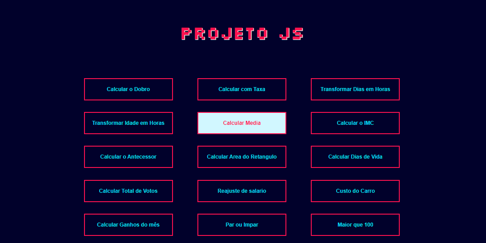
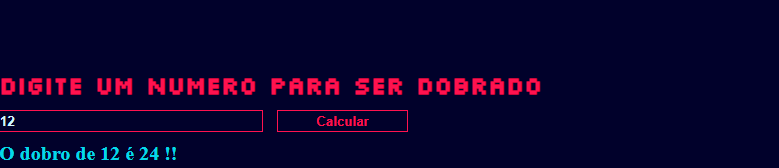

<h1 style="color:#05d9e8; font-weight: bold;     text-shadow: 1px 1px #d1f7ff;
">Projeto JS</h1>

O projeto JS é um projeto de faculdade onde cada botão feito em HTML/CSS executa uma função JS diferente, utilizando diversos metodos como Vetores, estruturas de decisão, repetição, variaveis e tipos de dados e funções de impressão na tela.

<li style="color:#ff124f;">Cada função é exibida no proprio site.</li>
<li style="color:#ff124f;">É possivel mexe-lo livremente sem a necessidade de atualizar.</li>

